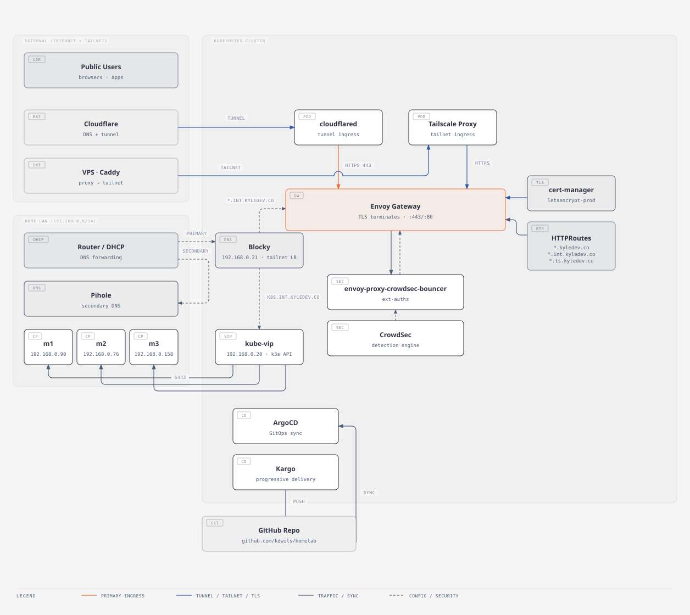

# Homelab

| Project  | Badge  | Description |
|----------|--------|--------|
| Apps |  | personal projects, open source apps, etc.|
| Infra |  | software critical to the cluster being operational |
| Media |  | media |
| Monitoring |  | cluster monitoring |

# About
This repo contains my declarative setup for my home k3s cluster. Applications are synced to the cluster via ArogCD, and the applications live under the `/apps` folder. I also manage ArgoCD itself via this repository after an initial manual deployment.

# Networking

How `*.kyledev.co` / `*.int.kyledev.co` / `*.ts.kyledev.co` resolve and route from the public internet / Tailscale / LAN down into the Envoy Gateway, and what surrounds that gateway inside the cluster (TLS issuance, internal DNS rewrite, security enforcement, and GitOps):

Generated from [`docs/diagrams/network-architecture.yaml`](docs/diagrams/network-architecture.yaml) — see [`docs/diagrams/README.md`](docs/diagrams/README.md) to regenerate or extend it.

# Declarative Secrets
Secrets are managed via the [SealedSecrets](https://github.com/bitnami-labs/sealed-secrets) operator. Secrets are encrypted prior to checking them into git, and then are decrypted by the operator once deployed to the cluster.
